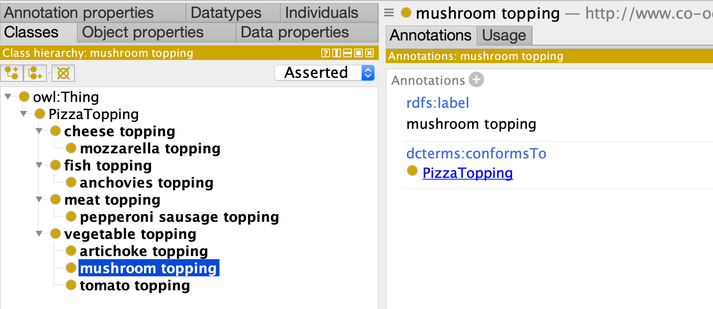

# Part 1: Basics

Let's start with absolute basics - our goal here is to make
a small simple hierarchy of *pizza toppings*.

To do this we need two components:

1. A *template* for pizza toppings
2. A collection of pizza topping *records*

In LinkML parlance, templates are *classes*, and records are *instances*, but note this can get confusing as our records/instances will be later translated to OWL *classes*!

Templates/classes are organized together in a *schema*, represented as a YAML file

## First Schema: Pizza Toppings

Here is our first schema:

[pizza01-toppings-model.yaml](pizza01-toppings-model.yaml):

```yaml
id: http://www.co-ode.org/ontologies/pizza/2005/10/18/pizza.owl
name: Pizza-Ontology-Metamodel
prefixes:
  pizza: http://www.co-ode.org/ontologies/pizza/2005/10/18/pizza.owl#
  linkml: https://w3id.org/linkml/
  dcterms: http://purl.org/dc/terms/
default_curi_maps:
    - semweb_context
default_prefix: pizza
imports:
  - linkml:types

classes:

  PizzaTopping:
    annotations:
      owl: Class
    attributes:
      id:
        name: id
        identifier: true
        range: uriorcurie
      label:
        name: label
        annotations:
          owl: AnnotationAssertion
        slot_uri: rdfs:label
      conforms_to:
        name: conforms_to
        annotations:
          owl.fstring: AnnotationAssertion( dcterms:conformsTo {id} pizza:{V} )
        slot_uri: dcterms:conformsTo
        designates_type: true
      subClassOf:
        name: subClassOf
        annotations:
          owl: SubClassOf
        slot_uri: rdfs:subClassOf
        range: PizzaTopping
```

The header part of the schema is fairly standard linkml boilerplate. We can focus our attention
on the `classes` section. Here we see we have introduced to represent pizza toppings.

__NOTE__: if you are familiar with OWL templating systems such as ROBOT and DOSDPs,
you may want to think of these classes as "templates"

We have 4 attributes at this time:

1. An *id*, which holds the unique IRI of the record (identifier is set to true)
2. A label, mapped to rdfs:label
3. conformsTo, which serves as the record type designator -- more on this below
4. subClassOf, mapped to rdfs:subClassOf

Note that the above schema is a standard LinkML schema, and you can
find out more details about the different schema elements on the
[linkml.io/linkml](https://linkml.io/linkml) site.

The LinkML-OWL framework makes use of OWL *interpretations* annotations on classes and attributes. In the above schema:

- records instantiating PizzaTopping are interpreted as [Classes](https://www.w3.org/TR/owl2-syntax/#Classes)
- labels are interpreted as [AnnotationAssertion](https://www.w3.org/TR/owl2-syntax/#Annotation_Assertion)s
- subClassOf is interprted as [SubClassOf](https://www.w3.org/TR/owl2-syntax/#Subclass_Axioms)

These are all terms in the official [OWL2 syntax](https://www.w3.org/TR/owl2-syntax), which can be consulted for more details

## Ontology Source Records

Next we provide a set of records that are used to populate our
template. These can be specified in different ways, but for many purposes YAML is the best.

We will create a file that is a YAML list, with each element being a
record that instantiates a PizzaTopping template. Each key in the record conforms to the above schema:

[pizza01-toppings-data.yaml](pizza01-toppings-data.yaml):

```yaml
# toppings
- id: pizza:FishTopping
  label: fish topping
  conforms_to: PizzaTopping
  subClassOf: pizza:PizzaTopping
- id: pizza:MeatTopping
  label: meat topping
  conforms_to: PizzaTopping
  subClassOf: pizza:PizzaTopping
- id: pizza:VegetableTopping
  label: vegetable topping
  conforms_to: PizzaTopping
  subClassOf: pizza:PizzaTopping
- id: pizza:CheeseTopping
  label: cheese topping
  conforms_to: PizzaTopping
  subClassOf: pizza:PizzaTopping

- id: pizza:PepperoniSausageTopping
  label: pepperoni sausage topping
  conforms_to: PizzaTopping
  subClassOf: pizza:MeatTopping

- id: pizza:AnchoviesTopping
  label: anchovies topping
  conforms_to: PizzaTopping
  subClassOf: pizza:FishTopping

- id: pizza:ArtichokeTopping
  label: artichoke topping
  conforms_to: PizzaTopping
  subClassOf: pizza:VegetableTopping

- id: pizza:MushroomTopping
  label: mushroom topping
  conforms_to: PizzaTopping
  subClassOf: pizza:VegetableTopping

- id: pizza:TomatoTopping
  label: tomato topping
  conforms_to: PizzaTopping
  subClassOf: pizza:VegetableTopping
  
- id: pizza:MozzarellaTopping
  label: mozzarella topping
  conforms_to: PizzaTopping
  subClassOf: pizza:CheeseTopping
```

Note that the conformsTo value is the same for every record. This may seem redundant, but as we will see later, an ontology is typically built from different templates.

Note the use of CURIEs throughout the file. Prefixes must be declared in the header of the schema

## Compiling to OWL

Next we will compile our PizzaTopping records to a PizzaTopping OWL ontology:

```bash
linkml-owl -s pizza01-toppings-model.yaml pizza01-toppings-data.yaml -o pizza01.ofn
```

This generates a file:

[pizza01.ofn](pizza01.ofn)

```owl
Ontology( <http://www.co-ode.org/ontologies/pizza/2005/10/18/pizza.owl>
    AnnotationAssertion( rdfs:label pizza:FishTopping "fish topping" )
    AnnotationAssertion( dcterms:conformsTo pizza:FishTopping pizza:PizzaTopping )
    SubClassOf( pizza:FishTopping pizza:PizzaTopping )
    AnnotationAssertion( rdfs:label pizza:MeatTopping "meat topping" )
    AnnotationAssertion( dcterms:conformsTo pizza:MeatTopping pizza:PizzaTopping )
    SubClassOf( pizza:MeatTopping pizza:PizzaTopping )
    AnnotationAssertion( rdfs:label pizza:VegetableTopping "vegetable topping" )
    AnnotationAssertion( dcterms:conformsTo pizza:VegetableTopping pizza:PizzaTopping )
    SubClassOf( pizza:VegetableTopping pizza:PizzaTopping )
    AnnotationAssertion( rdfs:label pizza:CheeseTopping "cheese topping" )
    AnnotationAssertion( dcterms:conformsTo pizza:CheeseTopping pizza:PizzaTopping )
    SubClassOf( pizza:CheeseTopping pizza:PizzaTopping )
    AnnotationAssertion( rdfs:label pizza:PepperoniSausageTopping "pepperoni sausage topping" )
    AnnotationAssertion( dcterms:conformsTo pizza:PepperoniSausageTopping pizza:PizzaTopping )
    SubClassOf( pizza:PepperoniSausageTopping pizza:MeatTopping )
    AnnotationAssertion( rdfs:label pizza:AnchoviesTopping "anchovies topping" )
    AnnotationAssertion( dcterms:conformsTo pizza:AnchoviesTopping pizza:PizzaTopping )
    SubClassOf( pizza:AnchoviesTopping pizza:FishTopping )
    AnnotationAssertion( rdfs:label pizza:ArtichokeTopping "artichoke topping" )
    AnnotationAssertion( dcterms:conformsTo pizza:ArtichokeTopping pizza:PizzaTopping )
    SubClassOf( pizza:ArtichokeTopping pizza:VegetableTopping )
    AnnotationAssertion( rdfs:label pizza:MushroomTopping "mushroom topping" )
    AnnotationAssertion( dcterms:conformsTo pizza:MushroomTopping pizza:PizzaTopping )
    SubClassOf( pizza:MushroomTopping pizza:VegetableTopping )
    AnnotationAssertion( rdfs:label pizza:MozzarellaTopping "mozzarella topping" )
    AnnotationAssertion( dcterms:conformsTo pizza:MozzarellaTopping pizza:PizzaTopping )
    SubClassOf( pizza:MozzarellaTopping pizza:CheeseTopping )
```

Note that the default output is OWL *functional syntax*. You can also use any serialization supported by rdflib.

We recommend ROBOT as an easy way to perform convesion between OWL serialization formats:

```bash
robot convert -i pizza01.ofn -o pizza01.owl
```

## Viewing in Proetege

You can also view the ontology in Protege:


