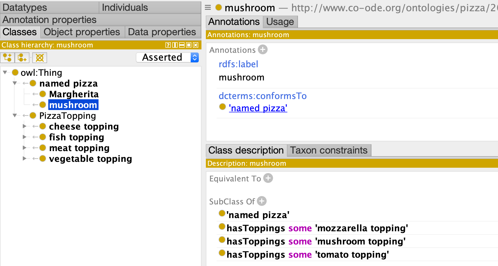

# Part 2: Adding Relationships

So far we have made a simple subsumption hierarchy with minimal metadata on each class

We will now extend the model to include relationships, modeled using
[existential restriction](https://www.w3.org/TR/owl2-syntax/#Existential_Quantification) axioms. Specifically, we will add some pizza classes
and relate them to toppings via a hasToppings relationships.

## Model

[pizza02-hasToppings-model.yaml](pizza02-hasToppings-model.yaml)

```yaml
id: http://www.co-ode.org/ontologies/pizza/2005/10/18/pizza.owl
name: Pizza-Ontology-Metamodel
prefixes:
  pizza: http://www.co-ode.org/ontologies/pizza/2005/10/18/pizza.owl#
  linkml: https://w3id.org/linkml/
  dcterms: http://purl.org/dc/terms/
default_curi_maps:
    - semweb_context
default_prefix: pizza
imports:
  - linkml:types

classes:

  ## ---
  ## this class is introduced here
  ## ---
  NamedPizza:
    annotations:
      owl: Class
    attributes:
      ## ---
      ## these attributes are the same as for PizzaTopping
      ## ---
      id:
        identifier: true
        range: uriorcurie
      label:
        annotations:
          owl: AnnotationAssertion
        slot_uri: rdfs:label
      conforms_to:
        annotations:
          owl.fstring: AnnotationAssertion( dcterms:conformsTo {id} pizza:{V} )
        slot_uri: dcterms:conformsTo
        designates_type: true
      subClassOf:
        annotations:
          owl: SubClassOf
        slot_uri: rdfs:subClassOf
        range: NamedPizza
        
      ## ---
      ## this attribute is unique to NamedPizza
      ## ---
      hasToppings:
        annotations:
          owl: ObjectSomeValuesFrom
        multivalued: true
        range: PizzaTopping
  ## ---
  ## copied from part 1
  ## ---
  PizzaTopping:
    attributes:
      id:
        identifier: true
        range: uriorcurie
      label:
        annotations:
          owl: AnnotationAssertion
        slot_uri: rdfs:label
      conforms_to:
        annotations:
          owl.fstring: AnnotationAssertion( dcterms:conformsTo {id} pizza:{V} )
        slot_uri: dcterms:conformsTo
        designates_type: true
      subClassOf:
        annotations:
          owl: SubClassOf
        slot_uri: rdfs:subClassOf
      hasToppings:
        singular_name: hasTopping
        range: PizzaTopping
        multivalued: true
        annotations:
          owl: ObjectSomeValuesFrom

```

Note that we have some repetition in the schema, with the same
information about the same attribute repeated in both `NamedPizza` and
`PizzaTopping` (although note the difference in range for subClassOf
in both classes). We will return to address this issue later.

Here we introduce a new slot/attribute `hasToppings`. This has an interpretation of [ObjectSomeValuesFrom](https://www.w3.org/TR/owl2-syntax/#Existential_Quantification)

## Data

Our new data file now has two kinds of records: PizzaToppings and NamedPizzas:

[pizza02-hasToppings-data.yaml](pizza02-hasToppings-data.yaml)

```yaml
# named pizzas
- id: pizza:NamedPizza
  conforms_to: NamedPizza
  label: named pizza
  
- id: pizza:Mushroom
  conforms_to: NamedPizza
  label: mushroom
  subClassOf: pizza:NamedPizza
  hasToppings:
    - pizza:MozzarellaTopping
    - pizza:MushroomTopping
    - pizza:TomatoTopping
- id: pizza:Margherita
  conforms_to: NamedPizza
  label: Margherita
  subClassOf: pizza:NamedPizza
  hasToppings:
    - pizza:MozzarellaTopping
    - pizza:TomatoTopping

# toppings
- id: pizza:FishTopping
  label: fish topping
  conforms_to: PizzaTopping
  subClassOf: pizza:PizzaTopping
- id: pizza:MeatTopping
  label: meat topping
  conforms_to: PizzaTopping
  subClassOf: pizza:PizzaTopping
- id: pizza:VegetableTopping
  label: vegetable topping
  conforms_to: PizzaTopping
  subClassOf: pizza:PizzaTopping
- id: pizza:CheeseTopping
  label: cheese topping
  conforms_to: PizzaTopping
  subClassOf: pizza:PizzaTopping

- id: pizza:PepperoniSausageTopping
  label: pepperoni sausage topping
  conforms_to: PizzaTopping
  subClassOf: pizza:MeatTopping

- id: pizza:AnchoviesTopping
  label: anchovies topping
  conforms_to: PizzaTopping
  subClassOf: pizza:FishTopping

- id: pizza:ArtichokeTopping
  label: artichoke topping
  conforms_to: PizzaTopping
  subClassOf: pizza:VegetableTopping

- id: pizza:MushroomTopping
  label: mushroom topping
  conforms_to: PizzaTopping
  subClassOf: pizza:VegetableTopping

- id: pizza:TomatoTopping
  label: tomato topping
  conforms_to: PizzaTopping
  subClassOf: pizza:VegetableTopping

- id: pizza:MozzarellaTopping
  label: mozzarella topping
  conforms_to: PizzaTopping
  subClassOf: pizza:CheeseTopping
```

Note the hasToppings slot is multivalued, so this is specified as a list.

## Output

[pizza02.ofn](pizza02.ofn):

```owl
Ontology( <http://www.co-ode.org/ontologies/pizza/2005/10/18/pizza.owl>
    AnnotationAssertion( rdfs:label pizza:Mushroom "mushroom" )
    AnnotationAssertion( dcterms:conformsTo pizza:Mushroom pizza:NamedPizza )
    SubClassOf( pizza:Mushroom     ObjectSomeValuesFrom( pizza:hasToppings pizza:MozzarellaTopping ) )
    SubClassOf( pizza:Mushroom     ObjectSomeValuesFrom( pizza:hasToppings pizza:MushroomTopping ) )
    SubClassOf( pizza:Mushroom     ObjectSomeValuesFrom( pizza:hasToppings pizza:TomatoTopping ) )
    AnnotationAssertion( rdfs:label pizza:Margherita "Margherita" )
    AnnotationAssertion( dcterms:conformsTo pizza:Margherita pizza:NamedPizza )
    SubClassOf( pizza:Margherita     ObjectSomeValuesFrom( pizza:hasToppings pizza:MozzarellaTopping ) )
    SubClassOf( pizza:Margherita     ObjectSomeValuesFrom( pizza:hasToppings pizza:TomatoTopping ) )
    AnnotationAssertion( rdfs:label pizza:FishTopping "fish topping" )
    AnnotationAssertion( dcterms:conformsTo pizza:FishTopping pizza:PizzaTopping )
    SubClassOf( pizza:FishTopping pizza:PizzaTopping )
    AnnotationAssertion( rdfs:label pizza:MeatTopping "meat topping" )
    AnnotationAssertion( dcterms:conformsTo pizza:MeatTopping pizza:PizzaTopping )
    SubClassOf( pizza:MeatTopping pizza:PizzaTopping )
    AnnotationAssertion( rdfs:label pizza:VegetableTopping "vegetable topping" )
    AnnotationAssertion( dcterms:conformsTo pizza:VegetableTopping pizza:PizzaTopping )
    SubClassOf( pizza:VegetableTopping pizza:PizzaTopping )
    AnnotationAssertion( rdfs:label pizza:CheeseTopping "cheese topping" )
    AnnotationAssertion( dcterms:conformsTo pizza:CheeseTopping pizza:PizzaTopping )
    SubClassOf( pizza:CheeseTopping pizza:PizzaTopping )
    AnnotationAssertion( rdfs:label pizza:PepperoniSausageTopping "pepperoni sausage topping" )
    AnnotationAssertion( dcterms:conformsTo pizza:PepperoniSausageTopping pizza:PizzaTopping )
    SubClassOf( pizza:PepperoniSausageTopping pizza:MeatTopping )
    AnnotationAssertion( rdfs:label pizza:AnchoviesTopping "anchovies topping" )
    AnnotationAssertion( dcterms:conformsTo pizza:AnchoviesTopping pizza:PizzaTopping )
    SubClassOf( pizza:AnchoviesTopping pizza:FishTopping )
    AnnotationAssertion( rdfs:label pizza:ArtichokeTopping "artichoke topping" )
    AnnotationAssertion( dcterms:conformsTo pizza:ArtichokeTopping pizza:PizzaTopping )
    SubClassOf( pizza:ArtichokeTopping pizza:VegetableTopping )
    AnnotationAssertion( rdfs:label pizza:MushroomTopping "mushroom topping" )
    AnnotationAssertion( dcterms:conformsTo pizza:MushroomTopping pizza:PizzaTopping )
    SubClassOf( pizza:MushroomTopping pizza:VegetableTopping )
    AnnotationAssertion( rdfs:label pizza:MozzarellaTopping "mozzarella topping" )
    AnnotationAssertion( dcterms:conformsTo pizza:MozzarellaTopping pizza:PizzaTopping )
    SubClassOf( pizza:MozzarellaTopping pizza:CheeseTopping )
```

In Protege:


