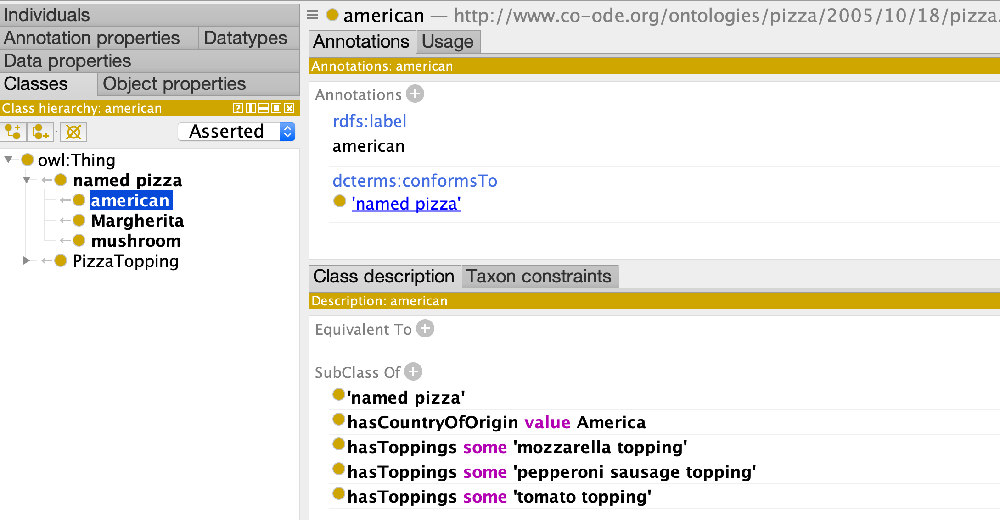

# Part 3: Individuals

Ontologies are typically comprised of *classes* but sometimes we
want to include *instances* (*Individuals*) -- for example, when 
relating a pizza class to a country of origin

## Schema

```yaml
id: http://www.co-ode.org/ontologies/pizza/2005/10/18/pizza.owl
name: Pizza-Ontology-Metamodel
prefixes:
  pizza: http://www.co-ode.org/ontologies/pizza/2005/10/18/pizza.owl#
  linkml: https://w3id.org/linkml/
  dcterms: http://purl.org/dc/terms/
default_curi_maps:
    - semweb_context
default_prefix: pizza
imports:
  - linkml:types

classes:
  ## ---
  ## The Country class is new in part 2
  ## ---
  Country:
    annotations:
      owl: NamedIndividual
    attributes:
      id:
        identifier: true
        range: uriorcurie
      label:
        annotations:
          owl: AnnotationAssertion
        slot_uri: rdfs:label
      conforms_to:
        annotations:
          owl.fstring: AnnotationAssertion( dcterms:conformsTo {id} pizza:{V} )
        slot_uri: dcterms:conformsTo
        designates_type: true
      typeOf:
        name: typeOf
        annotations:
          owl:
            tag: owl
            value: ClassAssertion
        from_schema: http://www.co-ode.org/ontologies/pizza/2005/10/18/pizza.owl
        slot_uri: rdf:type
  NamedPizza:
    annotations:
      owl: Class
    attributes:
      id:
        identifier: true
        range: uriorcurie
      label:
        annotations:
          owl: AnnotationAssertion
        slot_uri: rdfs:label
      conforms_to:
        annotations:
          owl.fstring: AnnotationAssertion( dcterms:conformsTo {id} pizza:{V} )
        slot_uri: dcterms:conformsTo
        designates_type: true
      subClassOf:
        annotations:
          owl: SubClassOf
        slot_uri: rdfs:subClassOf
      hasToppings:
        annotations:
          owl: ObjectSomeValuesFrom
        singular_name: hasTopping
        multivalued: true
        range: PizzaTopping
      ## ---
      ## This attribute is new in part 3:
      ## ---
      hasCountryOfOrigin:
        annotations:
          owl: ObjectHasValue
        range: Country
  PizzaTopping:
    attributes:
      id:
        identifier: true
        range: uriorcurie
      label:
        annotations:
          owl: AnnotationAssertion
        slot_uri: rdfs:label
      conforms_to:
        annotations:
          owl.fstring: AnnotationAssertion( dcterms:conformsTo {id} pizza:{V} )
        slot_uri: dcterms:conformsTo
        designates_type: true
      subClassOf:
        annotations:
          owl: SubClassOf
        slot_uri: rdfs:subClassOf
      hasToppings:
        singular_name: hasTopping
        range: PizzaTopping
        multivalued: true
        annotations:
          owl: ObjectSomeValuesFrom

```

## Records

```yaml
# named pizzas
- id: pizza:NamedPizza
  conforms_to: NamedPizza
  label: named pizza

- id: pizza:AmericanPizza
  conforms_to: NamedPizza
  label: american
  subClassOf: pizza:NamedPizza
  hasToppings:
    - pizza:MozzarellaTopping
    - pizza:PepperoniSausageTopping
    - pizza:TomatoTopping
  hasCountryOfOrigin: pizza:America
- id: pizza:Mushroom
  conforms_to: NamedPizza
  label: mushroom
  subClassOf: pizza:NamedPizza
  hasToppings:
    - pizza:MozzarellaTopping
    - pizza:MushroomTopping
    - pizza:TomatoTopping
- id: pizza:Margherita
  conforms_to: NamedPizza
  label: Margherita
  subClassOf: pizza:NamedPizza
  hasToppings:
    - pizza:MozzarellaTopping
    - pizza:TomatoTopping

# toppings
- id: pizza:FishTopping
  label: fish topping
  conforms_to: PizzaTopping
  subClassOf: pizza:PizzaTopping
- id: pizza:MeatTopping
  label: meat topping
  conforms_to: PizzaTopping
  subClassOf: pizza:PizzaTopping
- id: pizza:VegetableTopping
  label: vegetable topping
  conforms_to: PizzaTopping
  subClassOf: pizza:PizzaTopping
- id: pizza:CheeseTopping
  label: cheese topping
  conforms_to: PizzaTopping
  subClassOf: pizza:PizzaTopping

- id: pizza:PepperoniSausageTopping
  label: pepperoni sausage topping
  conforms_to: PizzaTopping
  subClassOf: pizza:MeatTopping

- id: pizza:AnchoviesTopping
  label: anchovies topping
  conforms_to: PizzaTopping
  subClassOf: pizza:FishTopping

- id: pizza:ArtichokeTopping
  label: artichoke topping
  conforms_to: PizzaTopping
  subClassOf: pizza:VegetableTopping

- id: pizza:MushroomTopping
  label: mushroom topping
  conforms_to: PizzaTopping
  subClassOf: pizza:VegetableTopping

- id: pizza:TomatoTopping
  label: tomato topping
  conforms_to: PizzaTopping
  subClassOf: pizza:VegetableTopping

- id: pizza:MozzarellaTopping
  label: mozzarella topping
  conforms_to: PizzaTopping
  subClassOf: pizza:CheeseTopping
```


## OWL


